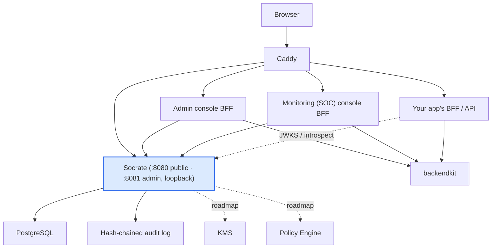
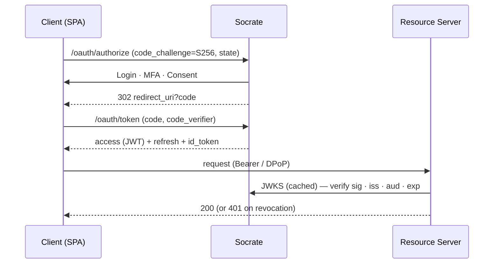
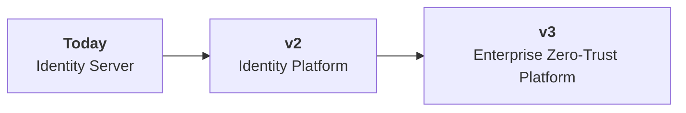

<div align="center">


# Socrate

> **The modern OAuth 2.1 & OpenID Connect identity platform for Go.**

Enterprise-grade identity for secure multi-tenant SaaS.

[](https://github.com/ovander/go-oauth2/actions/workflows/ci.yml)
[-00ADD8?logo=go&logoColor=white)](go.mod)
[](https://github.com/ovander/go-oauth2/releases)
[](docs/TEST-STRATEGY.md)
[](https://goreportcard.com/report/github.com/ovander/go-oauth2)
[](SECURITY.md#past-reviews)
[](https://semver.org)
[](docs/)
[](LICENSE)

</div>

### Why Socrate?

| | | |
|---|---|---|
| ✅ OAuth 2.1 + OIDC | ✅ Go-native, single binary | ✅ Self-hosted, no per-user pricing |
| ✅ Multi-tenant by design | ✅ Security-framework-first | ✅ Clear Zero-Trust roadmap |

### Why build on Socrate?

- **Because you own your identity.**
- **Because you own your roadmap.**
- **Because you own your security.**
- **Because you own your infrastructure.**
- **Because you own your costs.**

### Project status

`✅ Production ready` · `✅ API stable` · `✅ Four security audit passes (all findings closed)` · `✅ Actively maintained` · `✅ Used in production` · `✅ Apache-2.0 licensed`

> On a clear path toward a full Zero-Trust identity platform.

---

## Contents

[Architecture](#architecture) · [Who it's for](#who-its-for) · [Why another platform](#why-another-identity-platform) · [Features](#features) · [Security](#security) · [Philosophy](#philosophy) · [Maturity](#maturity) · [Quick start](#quick-start) · [Repository layout](#repository-layout) · [See it working](#see-it-working) · [Docs](#documentation) · [Roadmap](#roadmap) · [Contributing](#contributing) · [License](#license)

## Architecture

Socrate is the **identity core** of a four-repository suite. It issues and validates tokens and
runs the hosted login; a shared Go library (`backendkit`) enforces them inside every application
and provides the Backend-for-Frontend (BFF) runtime; two operator consoles ship as SPAs behind
their own BFFs, so **no browser in the suite ever holds an OAuth token**.



| Component | Role | Where |
|---|---|---|
| **Socrate** | OAuth 2.1/OIDC authorization, tokens, JWKS, hosted login/consent, MFA, invitations, per-app RBAC, admin API, security telemetry, tamper-evident audit | **This repo** |
| **backendkit** | Shared Go library: `jwtauth` (JWKS-validated bearer middleware), `bff` (server-side sessions, CSRF, fail-closed session→bearer proxy, login binding), `socrate` (API + token client), tiering, logging | [`ovander/backendkit`](https://github.com/ovander/backendkit) `v1.12.0` |
| **Admin console** | Vue SPA + Go BFF: clients, users, per-app roles, superadmins, step-up for destructive actions | [`ovander/oauth2-admin`](https://github.com/ovander/oauth2-admin) |
| **Monitoring console** | Vue SPA + Go BFF (optional Postgres sessions): security events, threats, geo analytics, alert rules, blocked IPs, reports, live event stream | [`ovander/oauth2-monitoring`](https://github.com/ovander/oauth2-monitoring) |
| **Applications** | Domain logic only; embed backendkit; own tenant-scoped data | Separate repos |
| **Infrastructure** | PostgreSQL + Caddy on one Linux VPS today ([runbook](docs/DEPLOYMENT-VPS-MULTI-APP.md)); KMS/HSM, policy engine, mesh on the roadmap | — |

Full target-state spec: [`PLATFORM-REFERENCE-ARCHITECTURE.md`](docs/PLATFORM-REFERENCE-ARCHITECTURE.md).

## Who it's for

| ✅ Designed for | 🚫 Not intended for |
|---|---|
| SaaS & multi-tenant platforms | Consumer/social IAM at massive scale |
| Enterprise APIs & services (M2M) | CMS plugins (WordPress, etc.) |
| Go-native platform engineering teams | Personal websites / hobby logins |
| AI platforms needing brokered identity | Drop-in hosted IDaaS replacement |

## Why another identity platform?

Heavyweight IdPs (Keycloak, Auth0, Okta) are powerful but **Java- or SaaS-centric, hard to extend,
and expensive at scale**. Rolling your own on Gin/Echo/chi means **owning the riskiest code
yourself** — JWT validation, key rotation, PKCE, revocation, audit. Socrate is the middle path:
**Go-native, self-hosted, standards-correct, and security-first.**

| Capability | Socrate | Keycloak | Auth0 |
|---|:---:|:---:|:---:|
| Go-native single binary | ✅ | ❌ | ❌ |
| Self-hosted, no per-user pricing | ✅ | ✅ | ❌ |
| OAuth 2.1 + PKCE / OIDC | ✅ | ✅ | ✅ |
| DPoP sender-constrained tokens | ✅ | ◑ | ◑ |
| Tamper-evident, hash-chained audit | ✅ | ◑ | ◑ |
| Security-framework-first design | ✅ | ❌ | ❌ |
| Published Zero-Trust roadmap | ✅ | — | — |

> *The comparison reflects the goals and architecture of each project rather than a
> feature-for-feature evaluation.*

## Features

What is in the code today (every item below is routed, tested and documented in [`docs/API.md`](docs/API.md)).

<table>
<tr>
<td valign="top" width="33%">

**🔐 Protocols & tokens**

- OAuth 2.1 Authorization Code + PKCE (S256 only)
- OpenID Connect: discovery, JWKS, ID tokens, UserInfo, `acr`/`amr`, `iss` response parameter
- Refresh rotation, single-use, reuse detection (`off/observe/enforce`)
- `client_credentials` service accounts
- Token exchange RFC 8693 (delegation + impersonation, per-client gated)
- DPoP RFC 9449 sender-constrained tokens, replay cache
- Introspection RFC 7662, revocation RFC 7009, end-session
- Audience binding (`dual` mode), RS256 key rotation with JWKS ring
- Confidential + public clients, exact redirect URIs, per-client PKCE/DPoP
- Per-client scope policy (`off/observe/enforce`) and declarative custom claims

</td>
<td valign="top" width="33%">

**👤 Authentication & users**

- Hosted login, consent, signup, password reset, invite pages (embedded templates)
- Password (bcrypt, timing-safe) + lockout
- TOTP MFA with encrypted secrets and one-time recovery codes
- Magic links (passwordless), email verification
- Invitations with app context; SMTP mail service
- Global roles (`user/admin/superadmin`) + per-app roles (`admin/manager/editor/viewer/user`)
- App-admin delegation: manage an app's members without global rights
- Service-account user provisioning (`/api/apps/{id}/service`)
- Self-service profile and MFA endpoints
- Nuclear (`token_version`) + per-token revocation with a [freshness SLA](docs/REVOCATION-FRESHNESS-SLA.md)

</td>
<td valign="top" width="33%">

**🛡️ Admin plane & security operations**

- Dual-port: public `:8080`, admin API `:8081` on loopback
- Global-admin gate, superadmin gate, forced password change, admin MFA policy
- Step-up (fresh `auth_time`) for destructive actions
- Least-privilege scope gating (`ADMIN_SCOPE_MODE`)
- Hash-chained, integrity-scanned security audit log; admin action log with CSV export
- Rate limiting, IP blocking, auto-defense (brute-force escalation), trusted-proxy model
- Security events, threat metrics, GeoIP analytics, sessions, token stats
- Alert rules + history, security reports (JSON/CSV), live SSE event stream
- Prometheus metrics on the admin port, with alert rules and a Grafana dashboard
- Two operator consoles on a token-less BFF model

</td>
</tr>
</table>

> Several controls (DPoP, token exchange, audience binding, refresh-reuse, admin MFA, admin scope
> gating) ship **default-off** behind `off / observe / enforce` modes, so you adopt them gradually.
> See [Maturity](#maturity) for what is on by default and what is not implemented.

## Security

**Principles** — secure by default · least privilege · defense in depth · standards first ·
verify at every boundary · backward-compatible migrations (never a flag day).

**Concretely:** Authorization-Code-with-PKCE only · DPoP (`cnf.jkt`) · audience-validated tokens ·
MFA & step-up · nuclear + per-token revocation with a [freshness SLA](docs/REVOCATION-FRESHNESS-SLA.md) ·
hash-chained audit · rate limiting, lockout, IP auto-blocking, CSRF, security headers, request-body
caps · client-IP attribution that trusts only `TRUSTED_PROXIES` · a token-less BFF model for every
first-party browser app.

**Audited, four internal passes, every accepted finding closed** (pass 4 scored 85 → 91/100). The
fixes are recorded in [`CHANGELOG.md`](CHANGELOG.md) with their finding IDs; how to report a
vulnerability and which versions are supported are in [`SECURITY.md`](SECURITY.md).

> **Roadmap controls** (not yet in this repo): KMS/HSM key custody, mTLS/SPIFFE, database RLS +
> envelope encryption, passkeys/WebAuthn. Today, signing keys are RSA-3072 PEM files on disk
> (`0400`, rotated in place).

## Philosophy

- **Standards first** — if an RFC defines it, follow the RFC.
- **Small trusted core** — minimal, legible, auditable surface.
- **Security before convenience** — the secure path is the default path.
- **Observe before enforce** — prove parity, then turn it on.
- **Zero flag days** — capabilities arrive additively.
- **Backward-compatible evolution** — over disruptive rewrites.

## Maturity

Socrate is **v1.5.0** on the v1.x line —
a single-instance, production-capable identity server with two operator consoles.

| ✅ Production ready (today) | ◻️ Roadmap |
|---|---|
| ✅ OAuth 2.1 / OIDC core (issue, verify, rotate) | ◻️ High availability & multi-region |
| ✅ Single-VPS production deployment ([runbook](docs/DEPLOYMENT-VPS-MULTI-APP.md), Caddy + Postgres, systemd kits) | ◻️ KMS / HSM key custody |
| ✅ Four security audit passes, all findings closed, scored | ◻️ Service mesh + mTLS / SPIFFE |
| ✅ CI gates (`-race`, `govulncheck`, lint, coverage ratchet) | ◻️ Tenant RLS + envelope encryption |
| ✅ Tested (169 test files incl. adversarial + fuzz suites) | ◻️ Federation, AI gateway, passkeys |
| ✅ MFA, DPoP, token exchange, audit, admin consoles | ◻️ Enforcement-by-default → **v2.0** |

**Honest limitations:** single-instance only (rate-limit, replay and IP-block state is in-process;
BFF sessions can be in Postgres). Not implemented: Device Flow, CIBA, PAR/JAR, FAPI profiles,
dynamic client registration, back-channel/front-channel logout, persisted consent, federation to
upstream IdPs (social login, SAML, LDAP), passkeys/WebAuthn, SCIM, outbound webhooks,
OpenTelemetry tracing, an OpenAPI document.

## Quick start

**5 minutes to your first token.**

```
git clone  →  make run  →  seed a superadmin  →  register a client  →  curl  →  JWT  →  ✅ done
```

**Prerequisites:** Go 1.25+ (the module pins `toolchain go1.27.1`, which the `go` command downloads), PostgreSQL 14+,
`make`, `openssl`.

```bash
git clone https://github.com/ovander/go-oauth2.git && cd go-oauth2
go mod download
cp .env.example .env          # edit DATABASE_URL, OAUTH_ISSUER, SECRET_KEY_BASE …
make gen-keys                 # RSA-3072 signing keypair + key_id under ./keys
AUTO_MIGRATE=true make run    # first start applies the schema; drop the flag afterwards
go run ./cmd/seed -email you@example.com -name "You"   # first superadmin (one-time password printed)
```

Register your first OAuth client through the admin API on `:8081` (or the
[admin console](https://github.com/ovander/oauth2-admin)); see [`docs/API.md` §8.2](docs/API.md).

```bash
make test          # full suite          make lint            # golangci-lint
make coverage-gate # Tier-A ratchet      make build           # -> bin/oauth-server
make docker-build  # distroless image from ./Dockerfile
```

## Repository layout

```
cmd/            server entry point + socrate-seed (first superadmin)
config/         env loading + production validation (feature-flag modes)
internal/
  handler/      HTTP handlers (oauth, auth, admin, app-users, mfa, magic link, monitoring, reports)
  http/         chi routers (public OAuth, loopback admin API, single-port variant)
  middleware/   auth, roles, step-up, scope gating, rate-limit, client-IP, DPoP, IP-block, body cap, headers
  service/      business logic (oauth, auth, mfa, magic link, audit, auto-defense, alerts, email)
  shared/auth/  token & crypto core: keys · dpop/ · tokenexchange/ · totp/ · PKCE · CSRF · consent
  database/migrate/  versioned schema steps applied with AUTO_MIGRATE=true
  model/ repository/ dto/ web/ (hosted pages) …
pkg/            logger, database
web/            embedded static assets        deploy/   VPS kit pointers
docs/           architecture, API, deployment runbook, audits, roadmaps
```

## See it working

Run the Authorization-Code-with-PKCE flow, then validate the token:

```bash
# Exchange an authorization code for tokens
curl -sX POST http://localhost:8080/oauth/token \
  -d grant_type=authorization_code -d code=$CODE \
  -d redirect_uri=https://app.example.com/callback \
  -d client_id=$CLIENT_ID -d code_verifier=$VERIFIER
```

Discovery is live and standards-compliant:

```jsonc
// GET /.well-known/openid-configuration
{
  "issuer": "https://localhost:8080",
  "authorization_endpoint": ".../oauth/authorize",
  "token_endpoint": ".../oauth/token",
  "userinfo_endpoint": ".../oauth/userinfo",
  "introspection_endpoint": ".../oauth/introspect",
  "revocation_endpoint": ".../oauth/revoke",
  "jwks_uri": ".../.well-known/jwks.json",
  "grant_types_supported": ["authorization_code", "refresh_token", "client_credentials"],   // + token-exchange when enabled
  "token_endpoint_auth_methods_supported": ["client_secret_basic", "client_secret_post"],
  "code_challenge_methods_supported": ["S256"],
  "scopes_supported": ["openid", "email", "profile", "offline_access", "api"],
  "acr_values_supported": ["pwd", "mfa"],
  "authorization_response_iss_parameter_supported": true
}
```

<details>
<summary>Authorization Code + PKCE flow (sequence diagram)</summary>


</details>

## Documentation

**Getting started** — [API & integration guide](docs/API.md) · [Authentication flows](docs/AUTH-FLOWS.md) · [`CHANGELOG.md`](CHANGELOG.md) · feature-flag modes in [`.env.example`](.env.example)

**Deploy & operate** — [Performance baseline & sizing](docs/PERFORMANCE-BASELINE.md) · [Linux VPS + Postgres + Caddy, multi-app runbook](docs/DEPLOYMENT-VPS-MULTI-APP.md) · [Pre-deploy checklist](deploy/PRE-DEPLOY-CHECKLIST.md) · [Migrating applications](deploy/migration/README.md) · [Revocation & freshness SLA](docs/REVOCATION-FRESHNESS-SLA.md) · [Alert rules](docs/ALERT-RULES.md) · [Geo analytics API](docs/GEO-ANALYTICS-API.md)

**Architecture** — [Reference architecture](docs/PLATFORM-REFERENCE-ARCHITECTURE.md) · [OP contract (v1.3)](deploy/migration/SOCRATE-V1.3.0-OP-CONTRACT.md)

**Extend & observe** — [Hooks, scope policy, custom claims](docs/EXTENSIBILITY.md) · [Metrics & log schema](docs/OBSERVABILITY.md)

**Security** — [Security policy and reporting](SECURITY.md)

**Development** — [Contributing](CONTRIBUTING.md) · [Test strategy & coverage gates](docs/TEST-STRATEGY.md) · [Test configuration](docs/TEST-CONFIGURATION.md) · [End-to-end harness](deploy/e2e/README.md)

## Roadmap

Capabilities arrive **additively** (observe), then **default-on**, then **mandatory** — never a flag day.



Planned work is tracked in [GitHub issues](https://github.com/ovander/go-oauth2/issues) — this README
stays a summary.

## Contributing

Small, traceable, reversible slices: **Issue → Branch → Conventional Commit → PR → Review → Merge**.

1. **Branch** off `main` (`feat/…`, `fix/…`, `docs/…`, `ci/…`); keep changes minimal and backward-compatible.
2. **Commit** with [Conventional Commits](https://www.conventionalcommits.org).
3. **Green CI required:** `gofmt`, `go vet`, `go test -race`, `golangci-lint`, `govulncheck`, and the
   Tier-A coverage ratchet (`make coverage-gate`).
4. **Update** `CHANGELOG.md` and any affected doc. New security controls ship **observe → enforce**.

**Releases** follow [SemVer](https://semver.org) with one planned breaking boundary (**v2.0**);
v1.x is additive. Legacy paths are deprecated and removed only after telemetry shows zero use.
The full workflow is in [CONTRIBUTING.md](CONTRIBUTING.md).

## Security policy

Report vulnerabilities **privately** through the repository's **Security** tab → **Report a
vulnerability** — not in public issues. The latest **v1.x** minor receives security fixes. Scope
and details are in [SECURITY.md](SECURITY.md).

## License

Socrate is licensed under the [Apache License 2.0](LICENSE).

---

<div align="center">

**Socrate is opinionated by design.**

It favors security over convenience, standards over proprietary extensions, and gradual evolution
over disruptive rewrites. Its goal is to become a trustworthy identity foundation for modern
Go-based SaaS platforms.

</div>
