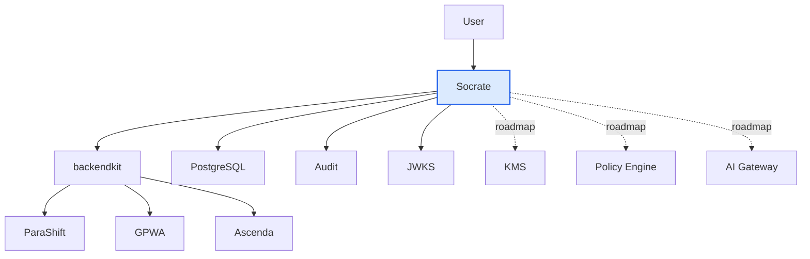
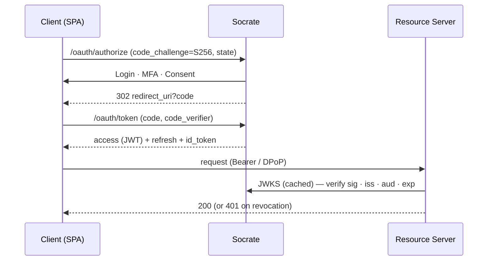
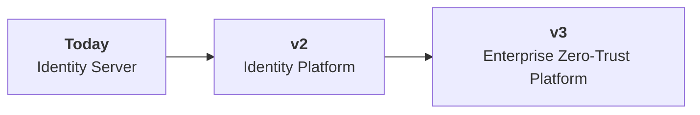

<div align="center">


# Socrate

> **The modern OAuth 2.1 & OpenID Connect identity platform for Go.**

Enterprise-grade identity for secure multi-tenant SaaS.

[](https://github.com/ovander/go-oauth2/actions/workflows/ci.yml)
[](go.mod)
[](CHANGELOG.md)
[](docs/program/TEST-STRATEGY.md)
[](https://goreportcard.com/report/github.com/ovandermoten/go-oauth2)
[](https://securityscorecards.dev)
[](docs/CR-identity-platform-security-pass1.md)
[](https://semver.org)
[](docs/)
[](#license)

</div>

### Why Socrate?

| | | |
|---|---|---|
| ✅ OAuth 2.1 + OIDC | ✅ Go-native, single binary | ✅ Self-hosted, no per-user pricing |
| ✅ Multi-tenant by design | ✅ Security-framework-first | ✅ Clear Zero-Trust roadmap |

### Why build on Socrate?

- **Because you own your identity.**
- **Because you own your roadmap.**
- **Because you own your security.**
- **Because you own your infrastructure.**
- **Because you own your costs.**

### Project status

`✅ Production ready` · `✅ API stable` · `✅ Security reviewed` · `✅ Actively maintained` · `✅ Used in production` · `✅ MIT licensed`

> On a clear path toward a full Zero-Trust identity platform.

---

## Contents

[Architecture](#architecture) · [Who it's for](#who-its-for) · [Why another platform](#why-another-identity-platform) · [Features](#features) · [Security](#security) · [Philosophy](#philosophy) · [Maturity](#maturity) · [Quick start](#quick-start) · [Repository layout](#repository-layout) · [See it working](#see-it-working) · [Docs](#documentation) · [Roadmap](#roadmap) · [Contributing](#contributing) · [License](#license)

## Architecture

Socrate is the **identity core** of a layered platform: it issues and validates tokens, while a
companion framework (`backendkit`) enforces them inside each application.



| Component | Role | Where |
|---|---|---|
| **Socrate** | OAuth 2.1/OIDC authorization, tokens, JWKS, MFA, identity audit | **This repo** |
| **backendkit** | Embedded enforcement point: verify tokens, propagate tenant context, emit audit | Companion repo *(roadmap)* |
| **Applications** | Domain logic only; embed backendkit; own tenant-scoped data | Separate repos |
| **Infrastructure** | PostgreSQL today; KMS/HSM, policy engine, AI gateway, mesh | Roadmap |

Full target-state spec: [`PLATFORM-REFERENCE-ARCHITECTURE.md`](docs/PLATFORM-REFERENCE-ARCHITECTURE.md).

## Who it's for

| ✅ Designed for | 🚫 Not intended for |
|---|---|
| SaaS & multi-tenant platforms | Consumer/social IAM at massive scale |
| Enterprise APIs & services (M2M) | CMS plugins (WordPress, etc.) |
| Go-native platform engineering teams | Personal websites / hobby logins |
| AI platforms needing brokered identity | Drop-in hosted IDaaS replacement |

## Why another identity platform?

Heavyweight IdPs (Keycloak, Auth0, Okta) are powerful but **Java- or SaaS-centric, hard to extend,
and expensive at scale**. Rolling your own on Gin/Echo/chi means **owning the riskiest code
yourself** — JWT validation, key rotation, PKCE, revocation, audit. Socrate is the middle path:
**Go-native, self-hosted, standards-correct, and security-first.**

| Capability | Socrate | Keycloak | Auth0 |
|---|:---:|:---:|:---:|
| Go-native single binary | ✅ | ❌ | ❌ |
| Self-hosted, no per-user pricing | ✅ | ✅ | ❌ |
| OAuth 2.1 + PKCE / OIDC | ✅ | ✅ | ✅ |
| DPoP sender-constrained tokens | ✅ | ◑ | ◑ |
| Tamper-evident, hash-chained audit | ✅ | ◑ | ◑ |
| Security-framework-first design | ✅ | ❌ | ❌ |
| Published Zero-Trust roadmap | ✅ | — | — |

> *The comparison reflects the goals and architecture of each project rather than a
> feature-for-feature evaluation.*

## Features

<table>
<tr>
<td valign="top" width="33%">

**🔐 Authentication**

- OAuth 2.1 + OIDC
- PKCE (S256)
- MFA / TOTP
- Magic links
- Password + recovery flows

</td>
<td valign="top" width="33%">

**🛡️ Security**

- DPoP sender-constraining
- Audience binding
- Key rotation + JWKS ring
- Tamper-evident audit
- Refresh-reuse detection

</td>
<td valign="top" width="33%">

**🏢 Enterprise**

- Multi-tenant (apps)
- Service accounts (M2M)
- Per-app RBAC
- Token exchange (delegation)
- Revocation freshness SLA

</td>
</tr>
</table>

> Several controls (DPoP, token exchange, audience binding, refresh-reuse, admin-MFA) ship
> **default-off** behind `off / observe / enforce` modes, so you adopt them gradually. See
> [Maturity](#maturity) for what's on by default.

## Security

**Principles** — secure by default · least privilege · defense in depth · standards first ·
verify at every boundary · backward-compatible migrations (never a flag day).

**Concretely:** Authorization-Code-with-PKCE only · DPoP (`cnf.jkt`) · audience-validated tokens ·
MFA & step-up · nuclear + per-token revocation with a [freshness SLA](docs/REVOCATION-FRESHNESS-SLA.md) ·
hash-chained audit · rate limiting, lockout, IP auto-blocking, CSRF, security headers. An independent
[security review](docs/CR-identity-platform-security-pass1.md) and a
[Zero-Trust verification](docs/CR-platform-zero-trust-verification.md) shaped the current posture.

> **Roadmap controls** (not yet in this repo): KMS/HSM key custody, mTLS/SPIFFE, database RLS +
> envelope encryption, passkeys/WebAuthn. Today, signing keys are RSA-3072 PEM files on disk.

## Philosophy

- **Standards first** — if an RFC defines it, follow the RFC.
- **Small trusted core** — minimal, legible, auditable surface.
- **Security before convenience** — the secure path is the default path.
- **Observe before enforce** — prove parity, then turn it on.
- **Zero flag days** — capabilities arrive additively.
- **Backward-compatible evolution** — over disruptive rewrites.

## Maturity

Socrate is **v1.0.0** — a single-instance, production-capable identity server.

| ✅ Production ready (today) | ◻️ Roadmap |
|---|---|
| ✅ OAuth 2.1 / OIDC core (issue, verify, rotate) | ◻️ High availability & multi-region |
| ✅ Single-instance production deployment | ◻️ KMS / HSM key custody |
| ✅ Security-reviewed & hardened | ◻️ Service mesh + mTLS / SPIFFE |
| ✅ CI gates (`-race`, vuln scan, lint, coverage ratchet) | ◻️ Tenant RLS + envelope encryption |
| ✅ Tested (80+ test files, adversarial + fuzz suites) | ◻️ Federation, AI gateway, passkeys |
| ✅ MFA, DPoP, token exchange, audit (flagged) | ◻️ Enforcement-by-default → **v2.0** |

**Honest limitations:** single-instance only (rate-limit/replay/IP state is in-process); KMS and
tenant data isolation are roadmapped; not implemented: Device Flow, CIBA, PAR/JAR, FAPI, federation.

## Quick start

**5 minutes to your first token.**

```
git clone  →  make run  →  curl  →  JWT  →  ✅ done
```

**Prerequisites:** Go 1.25+, PostgreSQL 14+, `make`, `openssl`, and [`goose`](https://github.com/pressly/goose).

```bash
git clone https://github.com/ovander/go-oauth2.git && cd go-oauth2
go mod download
cp .env.example .env          # edit DATABASE_URL, OAUTH_ISSUER, SECRET_KEY_BASE …
make gen-keys                 # RSA-3072 signing keypair + key_id
make migrate-up               # apply schema
make run                      # build + start (public :8080, admin via ADMIN_PORT)
```

```bash
make test          # full suite          make lint            # golangci-lint
make coverage-gate # Tier-A ratchet      make build           # -> bin/oauth-server
make docker-build  # (needs a Dockerfile — see Documentation)
```

## Repository layout

```
cmd/            entry point (server) + db seeder
config/         env loading + validation (feature-flag modes)
internal/
  handler/      HTTP handlers (oauth, auth, admin, mfa, monitoring)
  http/         chi router (single- and dual-port)
  middleware/   auth, rate-limit, DPoP, IP-block, CSRF, headers
  service/      business logic (oauth, auth, mfa, audit, exchange)
  shared/auth/  token & crypto core: dpop/ · tokenexchange/ · totp/
  model/ repository/ dto/ web/ …
pkg/            logger, database
web/            embedded templates + CSS     migrations/  goose SQL
docs/           architecture, API, roadmaps, reviews
```

## See it working

Run the Authorization-Code-with-PKCE flow, then validate the token:

```bash
# Exchange an authorization code for tokens
curl -sX POST http://localhost:8080/oauth/token \
  -d grant_type=authorization_code -d code=$CODE \
  -d redirect_uri=https://app.example.com/callback \
  -d client_id=$CLIENT_ID -d code_verifier=$VERIFIER
```

Discovery is live and standards-compliant:

```jsonc
// GET /.well-known/openid-configuration
{
  "issuer": "https://localhost:8080",
  "authorization_endpoint": ".../oauth/authorize",
  "token_endpoint": ".../oauth/token",
  "jwks_uri": ".../.well-known/jwks.json",
  "grant_types_supported": ["authorization_code", "refresh_token", "client_credentials"],
  "code_challenge_methods_supported": ["S256"],
  "acr_values_supported": ["pwd", "mfa"]
}
```

<details>
<summary>Authorization Code + PKCE flow (sequence diagram)</summary>


</details>

<!-- TODO(maintainer): drop UI screenshots here — login, consent, admin dashboard, audit log.
     Suggested: docs/assets/{login,consent,admin,audit}.png and embed below. -->

## Documentation

**Getting started** — [API & integration](docs/API.md) · [`CHANGELOG.md`](CHANGELOG.md)

**Architecture** — [Reference architecture](docs/PLATFORM-REFERENCE-ARCHITECTURE.md)

**Security** — [Security review](docs/CR-identity-platform-security-pass1.md) · [Zero-Trust verification](docs/CR-platform-zero-trust-verification.md) · [Revocation & freshness SLA](docs/REVOCATION-FRESHNESS-SLA.md)

**Operations** — [Revocation SLA](docs/REVOCATION-FRESHNESS-SLA.md) · feature-flag modes in [`.env.example`](.env.example)

**Roadmap** — [Program · Epics · RFCs · Releases](docs/program/)

**Development** — [Test strategy & coverage gates](docs/program/TEST-STRATEGY.md)

*Recommended additions:* `LICENSE`, `SECURITY.md`, `CONTRIBUTING.md`, `Dockerfile`.

## Roadmap

Capabilities arrive **additively** (observe), then **default-on**, then **mandatory** — never a flag day.



Detail lives in [`docs/program/`](docs/program/) — this README stays a summary.

## Contributing

Small, traceable, reversible slices: **Issue → Branch → Conventional Commit → PR → Review → Merge**.

1. **Branch** `feature/<issue>-<slug>` off `main`; keep changes minimal and backward-compatible.
2. **Commit** with [Conventional Commits](https://www.conventionalcommits.org).
3. **Green CI required:** `gofmt`, `go vet`, `go test -race`, `golangci-lint`, `govulncheck`, and the
   Tier-A coverage ratchet (`make coverage-gate`).
4. **Update** `CHANGELOG.md` and any affected doc. New security controls ship **observe → enforce**.

**Releases** follow [SemVer](https://semver.org) with one planned breaking boundary (**v2.0**);
v1.x is additive. Legacy paths are deprecated and removed only after telemetry shows zero use.

## Security policy

Report vulnerabilities **privately** via GitHub Security Advisories (*Report a vulnerability*) or
**olivier.vandermoten@gmail.com** — not public issues. The latest **v1.x** minor receives security
fixes. *(A `SECURITY.md` is recommended so GitHub surfaces this in the Security tab.)*

## License

**MIT.**

> ⚠️ **Before open-sourcing:** there is no `LICENSE` file yet, and some source files carry a stale
> proprietary "DTMA" header that contradicts the MIT intent. Add a top-level `LICENSE` and normalize
> those headers so the license is unambiguous.

---

<div align="center">

**Socrate is opinionated by design.**

It favors security over convenience, standards over proprietary extensions, and gradual evolution
over disruptive rewrites. Its goal is to become a trustworthy identity foundation for modern
Go-based SaaS platforms.

</div>
