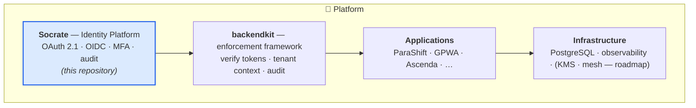
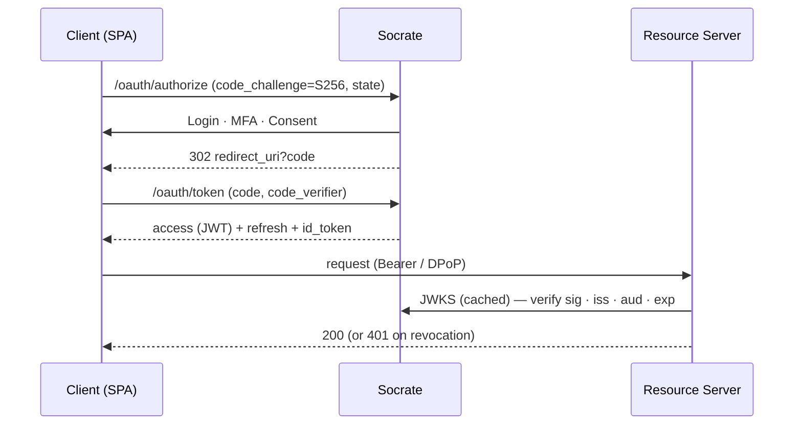
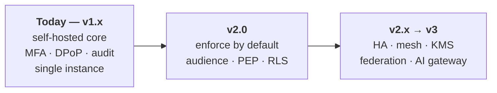

<div align="center">

# Socrate

**A modern OAuth 2.1 / OpenID Connect identity platform for Go — built for secure multi-tenant SaaS and Zero-Trust architectures.**

[](https://github.com/ovander/go-oauth2/actions/workflows/ci.yml)
[](go.mod)
[](CHANGELOG.md)
[](docs/CR-identity-platform-security-pass1.md)
[](#license)

`Actively developed` · `v1.0.0 — API stable` · `Security-reviewed` · `Single-instance production` · `Self-hosted` · `MIT`

</div>

### Why Socrate?

| | | | |
|---|---|---|---|
| ✅ OAuth 2.1 + OIDC | ✅ Go-native, single binary | ✅ Self-hosted, no per-user pricing |
| ✅ Multi-tenant by design | ✅ Security-framework-first | ✅ Clear Zero-Trust roadmap |

> Socrate isn't trying to match Auth0 feature-for-feature. It aims to be **the secure, self-hosted,
> Go-native identity foundation for enterprise SaaS** — a small, legible, trustworthy core you own.

---

## Contents

[Architecture](#architecture) · [Who it's for](#who-its-for) · [Why another platform](#why-another-identity-platform) · [Features](#features) · [Security](#security) · [Maturity](#maturity) · [Design principles](#design-principles) · [Quick start](#quick-start) · [See it working](#see-it-working) · [Docs](#documentation) · [Roadmap](#roadmap) · [Contributing](#contributing) · [License](#license)

## Architecture

Socrate is the **identity core** of a layered platform. It issues and validates tokens; a companion
framework (`backendkit`) enforces them inside each application.



| Component | Role | Where |
|---|---|---|
| **Socrate** | OAuth 2.1/OIDC authorization, tokens, JWKS, MFA, identity audit | **This repo** |
| **backendkit** | Embedded enforcement point: verify tokens, propagate tenant context, emit audit | Companion repo *(roadmap)* |
| **Applications** | Domain logic only; embed backendkit; own tenant-scoped data | Separate repos |
| **Infrastructure** | PostgreSQL today; KMS/HSM, service mesh, policy engine, AI gateway | Roadmap |

Full target-state spec: [`PLATFORM-REFERENCE-ARCHITECTURE.md`](docs/PLATFORM-REFERENCE-ARCHITECTURE.md).

## Who it's for

| ✅ Designed for | 🚫 Not intended for |
|---|---|
| SaaS & multi-tenant platforms | Consumer/social IAM at massive scale |
| Enterprise APIs & services (M2M) | CMS plugins (WordPress, etc.) |
| Go-native platform engineering teams | Personal websites / hobby logins |
| AI platforms needing brokered identity | Drop-in hosted IDaaS replacement |

## Why another identity platform?

Existing options force a hard trade-off. Heavyweight IdPs (Keycloak, Auth0, Okta) are powerful but
**Java- or SaaS-centric, hard to extend, and expensive at scale**. Rolling your own on Gin/Echo/chi
means **owning the riskiest code yourself** — JWT validation, key rotation, PKCE, revocation, audit.

Socrate is the middle path: **Go-native, self-hosted, standards-correct, and security-first**.

| Capability | Socrate | Keycloak | Auth0 |
|---|:---:|:---:|:---:|
| Go-native single binary | ✅ | ❌ | ❌ |
| Self-hosted, no per-user pricing | ✅ | ✅ | ❌ |
| OAuth 2.1 + PKCE / OIDC | ✅ | ✅ | ✅ |
| DPoP sender-constrained tokens | ✅ | ◑ | ◑ |
| Tamper-evident, hash-chained audit | ✅ | ◑ | ◑ |
| Security-framework-first design | ✅ | ❌ | ❌ |
| Published Zero-Trust roadmap | ✅ | — | — |

## Features

**Authentication** — password (bcrypt), passwordless magic links, MFA/TOTP with recovery codes,
email verification, password reset, invitations, lockout + brute-force auto-defense.

**OAuth 2.1 / OIDC** — Authorization Code + PKCE, Refresh (single-use rotation), Client Credentials;
Discovery, JWKS, ID Token, UserInfo, Introspection, Revocation; Token Exchange (delegation &
impersonation).

**Token security** — RS256 with rotating keys & retired-key ring; DPoP sender-constraining;
audience binding; refresh-reuse detection; `auth_time`/`acr`/`amr` context claims.

**Multi-tenancy** — apps as tenant boundaries, per-app user roles, per-app resource audiences,
isolated M2M service accounts.

**Operations & audit** — tamper-evident hash-chained audit + integrity scanner, correlation IDs,
structured JSON logs, dual-port topology, health/readiness probes, scheduled key rotation & cleanup,
documented revocation-freshness SLA.

> Several controls (DPoP, token exchange, audience binding, refresh-reuse, admin-MFA) ship
> **default-off** behind `off / observe / enforce` modes, so you adopt them gradually. See
> [Maturity](#maturity) for what's on by default.

## Security

**Principles**

- **Secure by default** — safest behavior wins; risky features are opt-in.
- **Least privilege** — scoped tokens, per-app roles, isolated service accounts.
- **Defense in depth** — rate limiting, lockout, IP auto-blocking, CSRF, security headers.
- **Standards first** — RFC-compliant tokens; `alg:none` and key-confusion rejected.
- **Zero Trust** — verify at every boundary, not just the edge.
- **Backward-compatible migrations** — new controls roll out observe-then-enforce, never as a flag day.

**Concretely:** Authorization-Code-with-PKCE only · DPoP (`cnf.jkt`) · audience-validated tokens ·
MFA & step-up · nuclear + per-token revocation with a [freshness SLA](docs/REVOCATION-FRESHNESS-SLA.md) ·
hash-chained audit. An independent internal [security review](docs/CR-identity-platform-security-pass1.md)
and a [Zero-Trust verification](docs/CR-platform-zero-trust-verification.md) drove the current posture.

> **Roadmap controls** (not yet in this repo): KMS/HSM key custody, mTLS/SPIFFE, database RLS +
> envelope encryption, passkeys/WebAuthn. Today, signing keys are RSA-3072 PEM files on disk.

## Maturity

Socrate is **v1.0.0** — a single-instance, production-capable identity server.

| ✅ Production ready (today) | ◻️ Roadmap |
|---|---|
| ✅ OAuth 2.1 / OIDC core (issue, verify, rotate) | ◻️ High availability & multi-region |
| ✅ Single-instance production deployment | ◻️ KMS / HSM key custody |
| ✅ Security-reviewed & hardened | ◻️ Service mesh + mTLS / SPIFFE |
| ✅ CI gates (`-race`, vuln scan, lint, coverage ratchet) | ◻️ Tenant RLS + envelope encryption |
| ✅ Tested (80+ test files, adversarial + fuzz suites) | ◻️ Federation, AI gateway, passkeys |
| ✅ MFA, DPoP, token exchange, audit (flagged) | ◻️ Enforcement-by-default → **v2.0** |

**Honest limitations:** single-instance only (rate-limit/replay/IP state is in-process); KMS and
tenant data isolation are roadmapped; not implemented: Device Flow, CIBA, PAR/JAR, FAPI, federation.

## Design principles

- **Standards over proprietary** — if an RFC defines it, follow the RFC.
- **Security over convenience** — the secure path is the default path.
- **Explicit over implicit** — behavior is configured and visible, not magic.
- **Feature flags before breaking changes** — and **observe before enforce**.
- **Small trusted core** — minimal, legible, auditable surface.
- **Enterprise-first & cloud-neutral** — self-hosted, no vendor lock-in.

## Quick start

**Prerequisites:** Go 1.25+, PostgreSQL 14+, `make`, `openssl`, and [`goose`](https://github.com/pressly/goose).

```bash
git clone https://github.com/ovander/go-oauth2.git && cd go-oauth2
go mod download
cp .env.example .env          # edit DATABASE_URL, OAUTH_ISSUER, SECRET_KEY_BASE …
make gen-keys                 # RSA-3072 signing keypair + key_id
make migrate-up               # apply schema
make run                      # build + start (public :8080, admin via ADMIN_PORT)
```

```bash
make test          # full suite          make lint            # golangci-lint
make coverage-gate # Tier-A ratchet      make build           # -> bin/oauth-server
make docker-build  # (needs a Dockerfile — see Documentation)
```

## See it working

Run the Authorization-Code-with-PKCE flow, then validate the token:

```bash
# Exchange an authorization code for tokens
curl -sX POST http://localhost:8080/oauth/token \
  -d grant_type=authorization_code -d code=$CODE \
  -d redirect_uri=https://app.example.com/callback \
  -d client_id=$CLIENT_ID -d code_verifier=$VERIFIER
```

Discovery is live and standards-compliant:

```jsonc
// GET /.well-known/openid-configuration
{
  "issuer": "https://localhost:8080",
  "authorization_endpoint": ".../oauth/authorize",
  "token_endpoint": ".../oauth/token",
  "jwks_uri": ".../.well-known/jwks.json",
  "grant_types_supported": ["authorization_code", "refresh_token", "client_credentials"],
  "code_challenge_methods_supported": ["S256"],
  "acr_values_supported": ["pwd", "mfa"]
}
```

<details>
<summary>Authorization Code + PKCE flow (sequence diagram)</summary>


</details>

<!-- TODO(maintainer): drop UI screenshots here — login, consent, admin dashboard, audit log.
     Suggested: docs/images/{login,consent,admin,audit}.png and embed below. -->

## Documentation

| Topic | Document |
|---|---|
| API & integration | [`docs/API.md`](docs/API.md) |
| Reference architecture (target) | [`PLATFORM-REFERENCE-ARCHITECTURE.md`](docs/PLATFORM-REFERENCE-ARCHITECTURE.md) |
| Security review · Zero-Trust verification | [pass 1](docs/CR-identity-platform-security-pass1.md) · [ZT](docs/CR-platform-zero-trust-verification.md) |
| Revocation & freshness SLA | [`REVOCATION-FRESHNESS-SLA.md`](docs/REVOCATION-FRESHNESS-SLA.md) |
| Test strategy & coverage gates | [`TEST-STRATEGY.md`](docs/program/TEST-STRATEGY.md) |
| Program · Epics · RFCs · Releases | [`docs/program/`](docs/program/) |
| Release notes | [`CHANGELOG.md`](CHANGELOG.md) |

*Recommended additions:* `LICENSE`, `SECURITY.md`, `CONTRIBUTING.md`, `Dockerfile` (see below).

<details>
<summary>Repository layout</summary>

```
cmd/            entry point (server) + db seeder
config/         env loading + validation (feature-flag modes)
internal/
  handler/      HTTP handlers (oauth, auth, admin, mfa, monitoring)
  http/         chi router (single- and dual-port)
  middleware/   auth, rate-limit, DPoP, IP-block, CSRF, headers
  service/      business logic (oauth, auth, mfa, audit, exchange)
  shared/auth/  token & crypto core: dpop/ · tokenexchange/ · totp/
  model/ repository/ dto/ web/ …
pkg/            logger, database
web/            embedded templates + CSS     migrations/  goose SQL
docs/           architecture, API, roadmaps, reviews
```
</details>

## Roadmap

Capabilities arrive **additively** (observe), then **default-on**, then **mandatory** — never a flag day.



Detail lives in [`docs/program/`](docs/program/) — this README stays a summary.

## Contributing

Small, traceable, reversible slices: **Issue → Branch → Conventional Commit → PR → Review → Merge**.

1. **Branch** `feature/<issue>-<slug>` off `main`; keep changes minimal and backward-compatible.
2. **Commit** with [Conventional Commits](https://www.conventionalcommits.org).
3. **Green CI required:** `gofmt`, `go vet`, `go test -race`, `golangci-lint`, `govulncheck`, and the
   Tier-A coverage ratchet (`make coverage-gate`).
4. **Update** `CHANGELOG.md` and any affected doc. New security controls ship **observe → enforce**.

**Releases** follow [SemVer](https://semver.org) with one planned breaking boundary (**v2.0**);
v1.x is additive. Legacy paths are deprecated and removed only after telemetry shows zero use.

## Security policy

Report vulnerabilities **privately** via GitHub Security Advisories (*Report a vulnerability*) or
**olivier.vandermoten@gmail.com** — not public issues. The latest **v1.x** minor receives security
fixes. *(A `SECURITY.md` is recommended so GitHub surfaces this in the Security tab.)*

## License

**MIT.**

> ⚠️ **Before open-sourcing:** there is no `LICENSE` file yet, and some source files carry a stale
> proprietary "DTMA" header that contradicts the MIT intent. Add a top-level `LICENSE` and normalize
> those headers so the license is unambiguous.

---

<div align="center"><sub>Socrate — the secure, self-hosted, Go-native identity foundation for enterprise SaaS.</sub></div>
