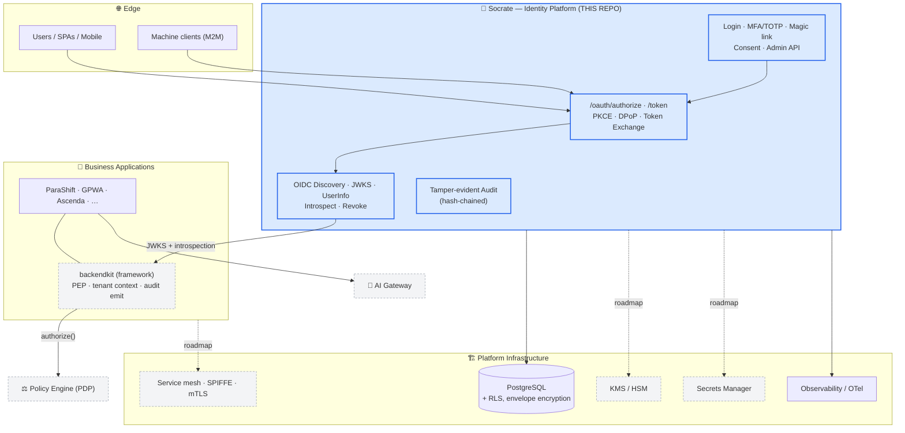
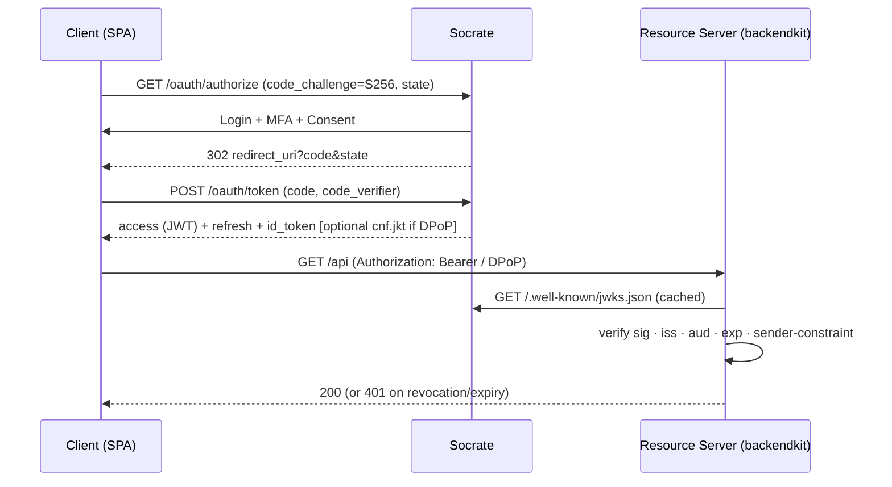
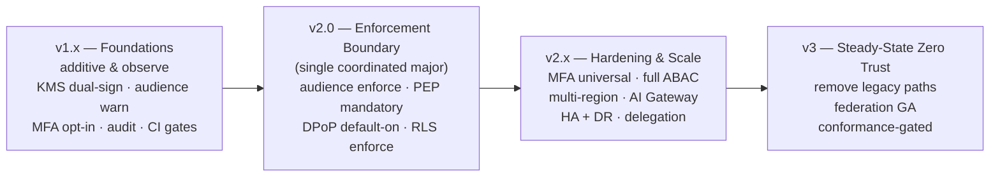

<div align="center">

# Socrate

### An enterprise-grade OAuth 2.1 / OpenID Connect identity platform, written in Go.

[](https://github.com/ovander/go-oauth2/actions/workflows/ci.yml)
[](go.mod)
[](CHANGELOG.md)
[-success)](docs/program/TEST-STRATEGY.md)
[](https://www.conventionalcommits.org)
[](#15-license)

*Standards-based tokens · sender-constrained DPoP · MFA · tamper-evident audit · feature-flagged rollout · RFC-traceable roadmap*

</div>

---

> **Socrate** is the authoritative identity service (the IdP / authorization server) at the
> heart of a broader Zero-Trust platform. This repository is Socrate itself. The companion
> components it is designed to work with — the `backendkit` enforcement framework, the policy
> engine, the AI gateway, and the supporting infrastructure — are described in
> [§4 Architecture](#4-architecture-overview) and live (or will live) in their own repositories.

## Table of Contents

1. [Project Overview](#1-project-overview)
2. [Why this project exists](#2-why-this-project-exists)
3. [Key Features](#3-key-features)
4. [Architecture Overview](#4-architecture-overview)
5. [Security by Design](#5-security-by-design)
6. [Current Maturity](#6-current-maturity)
7. [Repository Layout](#7-repository-layout)
8. [Quick Start](#8-quick-start)
9. [Example](#9-example)
10. [Documentation](#10-documentation)
11. [Roadmap](#11-roadmap)
12. [Contributing](#12-contributing)
13. [Release Policy](#13-release-policy)
14. [Security Policy](#14-security-policy)
15. [License](#15-license)

---

## 1. Project Overview

Socrate is a production-capable **OAuth 2.1 and OpenID Connect** authorization server and identity
provider built in Go. It issues and validates standards-compliant tokens (RS256 JWTs with rotating
keys and a published JWKS), authenticates users with passwords, magic links and TOTP multi-factor,
and gives platform teams a single, auditable source of identity for first-party applications and
machine-to-machine services. Every security control ships behind a feature flag and graduates
through an **observe → enforce** rollout, so capabilities can be adopted without a flag day.

## 2. Why this project exists

Most teams reach for one of two options and regret it later:

- **A web framework** (Gin, Echo, chi…) plus a pile of bespoke auth code. You end up owning JWT
  validation, key rotation, PKCE, refresh-token rotation, revocation propagation and audit — the
  exact surface where subtle mistakes become breaches.
- **A heavyweight IdP** (Keycloak, Auth0, Okta…). Powerful, but you trade away control: opaque
  internals, per-MAU pricing, Java/SaaS operational models, and limited ability to evolve the
  security posture on your own terms or embed it in a Go-native, Zero-Trust platform.

Socrate occupies the middle ground deliberately:

| | Hand-rolled auth | Keycloak / Auth0 | **Socrate** |
|---|:---:|:---:|:---:|
| Standards-correct tokens, JWKS, rotation | ⚠️ you build it | ✅ | ✅ |
| Self-hosted, no per-user pricing | ✅ | ⚠️ / ❌ | ✅ |
| Go-native, single static binary | ✅ | ❌ | ✅ |
| Sender-constrained tokens (DPoP) | ❌ | ⚠️ | ✅ (flagged) |
| Tamper-evident, hash-chained audit | ❌ | ⚠️ | ✅ |
| Gradual **observe → enforce** rollout of every control | ❌ | ❌ | ✅ |
| RFC-traceable roadmap to full Zero Trust | ❌ | ❌ | ✅ |

It exists to be the **trustworthy, legible, self-hostable root of identity** for a platform that
intends to take Zero Trust seriously — not as a slogan, but as a sequenced, testable program.

## 3. Key Features

<table>
<tr><td valign="top" width="50%">

**🔑 Authentication**
- Password (bcrypt) login & registration
- Passwordless **magic links** (single-use, hashed-at-rest)
- **MFA / TOTP** with one-time recovery codes
- Email verification, password reset, invitations
- Account lockout + brute-force **auto-defense** (IP blocking)

**🪙 OAuth 2.1 / OIDC**
- Authorization Code + **PKCE** (S256), Refresh Token, Client Credentials
- OIDC Discovery, JWKS, ID Token, UserInfo
- Token **Introspection** (RFC 7662) & **Revocation** (RFC 7009)
- **Token Exchange** (RFC 8693) — delegation & impersonation

**🛡️ Token Security**
- RS256 JWTs with `kid`, rotating keys, retired-key ring in JWKS
- **DPoP** sender-constraining (RFC 9449)
- **Audience binding** (RFC-001) — `off` / `dual` modes
- Single-use refresh rotation + **reuse detection** (RFC 9700)
- `auth_time` / `acr` / `amr` authentication-context claims

</td><td valign="top" width="50%">

**🏢 Multi-tenancy**
- Apps (OAuth clients) as tenant boundaries
- Per-app user roles (admin / manager / editor / viewer)
- Per-app registered resource **audiences**
- Isolated M2M **service accounts** (client-credentials, URL-bound)

**🔭 Observability & Audit**
- Hash-chained, HMAC-stamped **tamper-evident audit** (RFC-007)
- Scheduled audit-integrity scanner
- Correlation-ID propagation end-to-end (RFC-008)
- Structured **JSON logs** in prod, level-by-outcome, DEBUG flow tracing

**⚙️ Operations**
- Dual-port topology (public OAuth / private admin)
- Health, liveness & readiness probes; graceful shutdown
- Scheduled key rotation, used-token cleanup, integrity scans
- **Revocation freshness SLA** (RFC-012)

**🧰 Developer Experience**
- Single static binary; embedded templates & assets
- Feature-flagged, **observe → enforce** rollout for every control
- CI gates: `-race`, `govulncheck`, lint, **Tier-A coverage ratchet**
- RFC / Epic / Capability traceability on every change

</td></tr>
</table>

> Several controls (DPoP, token exchange, audience binding, refresh-reuse handling, admin-MFA) are
> **shipped but default-off**, gated by `off / observe / enforce` modes so you can roll them out
> gradually. See [§6 Current Maturity](#6-current-maturity) for exactly what is on by default.

## 4. Architecture Overview

Socrate is the identity core of a layered Zero-Trust platform. The diagram shows the **target
ecosystem**; the shaded note marks what lives in *this* repository today versus companion repos and
infrastructure that are on the [roadmap](#11-roadmap).



| Component | What it does | Where it lives |
|---|---|---|
| **Socrate** | OAuth 2.1/OIDC authorization, token issuance, JWKS, MFA, identity audit. The most-privileged trust boundary. | **This repository** |
| **backendkit** | Mandatory security substrate embedded in every app: the Policy **Enforcement** Point (PEP), token verification, tenant-context propagation, audit emission. | Companion repo *(roadmap)* |
| **Applications** | Domain logic only (ParaShift, GPWA, Ascenda…); embed backendkit; own tenant-scoped data. | Separate repos |
| **Policy Engine (PDP)** | Policy-as-code decision point that backendkit consults to authorize requests. | Roadmap (EPIC-10) |
| **AI Gateway** | The sole mediated path to model providers — per-tenant isolation, redaction, governance, audit. | Roadmap (EPIC-15) |
| **Infrastructure** | PostgreSQL (with RLS + envelope encryption), KMS/HSM, secrets manager, observability pipeline, SPIFFE service mesh. | Platform / roadmap |

The full normative target is specified in
[`docs/PLATFORM-REFERENCE-ARCHITECTURE.md`](docs/PLATFORM-REFERENCE-ARCHITECTURE.md) — a
*destination*, not a description of the current system.

<details>
<summary><b>Authorization Code + PKCE flow (sequence)</b></summary>


</details>

## 5. Security by Design

Socrate's philosophy: **never trust the network, verify at every boundary, and prefer
theft-resistant tokens to long-lived bearer secrets** — rolled out gradually so security never
ships as a flag day.

- **Zero Trust posture.** Identity is verified at each hop, not just at the edge. The platform's
  target trust model (and an honest gap analysis of where it stands) is documented in
  [`docs/CR-platform-zero-trust-verification.md`](docs/CR-platform-zero-trust-verification.md).
- **OAuth 2.1 / OIDC.** Authorization-Code-with-PKCE only (implicit & password grants removed);
  mandatory `state`; consent enforced. RS256 with `alg:none` and RS↔HS confusion rejected.
- **Audience validation (RFC-001).** Tokens carry registered resource audiences (`dual` mode) so
  resource servers verify *their own* identifier — the substrate for canonical-only enforcement.
- **Sender-constrained tokens (DPoP, RFC 9449).** A leaked token is unusable without the holder's
  key (`cnf.jkt`), available on the token endpoint and on token-exchange results.
- **MFA & step-up.** TOTP with recovery codes; admin-MFA policy; delegation/impersonation step-up
  keyed on `amr`/`auth_time`. (Phishing-resistant **passkeys/WebAuthn** are roadmapped — EPIC-9.)
- **Revocation propagation (RFC-012).** Nuclear (token-version) and per-token (JTI) revocation with
  a documented **freshness SLA** — immediate for introspecting/Socrate-authenticated resource
  servers, ≤ `ACCESS_TOKEN_TTL` for offline validators.
- **Tamper-evident audit (RFC-007).** Security events are HMAC-stamped and **hash-chained**;
  a scheduled scanner detects deletion or reordering.
- **Defense in depth.** Per-IP rate limiting on login/signup/token, account lockout, automatic
  attacker IP blocking, CSRF double-submit, security headers, constant-time secret comparison.

> **Roadmap (target-state) controls** — KMS/HSM key custody, mTLS/SPIFFE workload identity,
> database Row-Level Security and envelope encryption, and dynamic secrets — are part of the
> reference architecture and tracked as Epics; they are **not yet implemented in this repository**.
> Today, signing keys are RSA-3072 PEM files on disk with restrictive permissions. See
> [§6 Current Maturity](#6-current-maturity).

## 6. Current Maturity

Socrate is at **v1.0.0** — a single-instance, production-capable identity server. The table is
deliberately conservative; flags marked *default-off* are implemented and tested but inert until you
enable them.

| ✅ Implemented (v1.0.0) | 🟡 Available, default-off (observe → enforce) | 🔭 Planned (roadmap) |
|---|---|---|
| Auth Code + PKCE, Refresh (single-use rotation), Client Credentials | **DPoP** sender-constraint (`DPOP_MODE`) | KMS / HSM key custody (EPIC-3 / RFC-002) |
| OIDC Discovery, JWKS, ID Token, UserInfo, Introspect, Revoke | **Token Exchange** delegation/impersonation (`TOKEN_EXCHANGE_MODE`) | mTLS + SPIFFE workload identity (EPIC-1) |
| RS256 + key rotation + retired-key ring | **Audience binding** `dual` (`AUDIENCE_MODE`) | backendkit **PEP** as mandatory enforcement (EPIC-11) |
| MFA / TOTP + recovery codes; magic links | **Refresh-reuse** family revocation (`REFRESH_REUSE_MODE`) | Policy Engine / ABAC (EPIC-10) |
| Tamper-evident hash-chained audit + scanner | **Admin-MFA** policy (`ADMIN_MFA_POLICY`) | Tenant **RLS** + envelope encryption (EPIC-12) |
| Revocation propagation + freshness SLA | Delegation/impersonation **step-up** | Distributed state, **HA + DR** (EPIC-13/16) |
| Rate limiting, lockout, auto-defense IP blocking | Scheduled **key rotation** & audit-integrity scan | **AI Gateway** (EPIC-15) · **Federation** (EPIC-18) |
| Structured JSON logging + correlation IDs (RFC-008) | | Passkeys / WebAuthn (EPIC-9 later) |
| CI gates + Tier-A coverage ratchet | | **Enforcement-by-default** boundary → **v2.0** |

**Honest limitations.** This release is *single-instance*: rate-limit, DPoP-replay and IP-block
state are in-process, so horizontal scale-out awaits distributed state (EPIC-13). Highest-assurance
key custody (KMS/HSM) and tenant data isolation (RLS) are roadmapped. An independent internal
security review ([pass 1](docs/CR-identity-platform-security-pass1.md)) drove substantial hardening
across the v0.x line; **enforcement-by-default** of audience/DPoP/PEP is the deliberate **v2.0**
boundary. Not yet implemented: Device Flow, CIBA, PAR/JAR, FAPI profiles, external federation.

## 7. Repository Layout

```
go-oauth2/
├── cmd/
│   ├── server/            # Entry point — bootstrap wires all dependencies
│   └── seed/              # Database seeding utility
├── config/                # Env loading + validation (feature-flag modes)
├── internal/
│   ├── contextkeys/       # Typed context keys (user, correlation_id, dpop jkt)
│   ├── database/          # DB init + migration runner
│   ├── dto/               # Request/response shapes
│   ├── handler/           # HTTP handlers (oauth, auth, admin, mfa, monitoring)
│   ├── http/              # chi router setup (single- and dual-port)
│   ├── middleware/        # auth, rate-limit, DPoP, IP-block, CSRF, headers
│   ├── model/             # GORM domain models (User, App, AuditLog, …)
│   ├── repository/        # Data-access layer (interfaces + GORM impls)
│   ├── service/           # Business logic (oauth, auth, mfa, audit, exchange)
│   ├── shared/auth/        # Token & crypto core
│   │   ├── dpop/          # DPoP proof verification + replay cache
│   │   ├── tokenexchange/ # RFC 8693 parsing & policy
│   │   └── totp/          # TOTP MFA
│   ├── version/           # Build-time version info
│   └── web/               # Server-rendered auth pages
├── pkg/
│   ├── database/          # Connection pooling
│   └── logger/            # Structured logging (logrus wrapper)
├── web/                   # Embedded templates + static CSS
├── migrations/            # goose SQL migrations
├── scripts/               # coverage-gate.sh (Tier-A ratchet)
├── docs/                  # Architecture, API, RFC/Epic roadmaps, reviews
└── .github/workflows/     # CI pipeline
```

## 8. Quick Start

### Prerequisites
- **Go 1.25+**
- **PostgreSQL 14+**
- `make`, `openssl`, and [`goose`](https://github.com/pressly/goose) (for migrations)

### Install & configure
```bash
git clone https://github.com/ovander/go-oauth2.git
cd go-oauth2
go mod download

cp .env.example .env            # then edit DATABASE_URL, OAUTH_ISSUER, SECRET_KEY_BASE, …
make gen-keys                   # generate RSA-3072 signing keypair + key_id
make migrate-up                 # apply schema (uses $DATABASE_URL)
```

### Run, test, lint, build
```bash
make run                # build + start the server
make test               # full test suite (-v)
make test-coverage      # tests + HTML coverage report
make coverage-gate      # Tier-A security-critical coverage ratchet (blocking)
make lint               # golangci-lint
make fmt                # gofmt
make build              # static binary -> bin/oauth-server
```

### Docker
```bash
make docker-build       # docker build -t oauth-server .
make docker-run         # runs on :8080 with --env-file .env
```
> ℹ️ A root `Dockerfile` is **not yet committed** — see
> [§ recommended additions](#10-documentation). `make docker-build` expects one at the repo root.

The server exposes a public OAuth surface (default `:8080`) and an admin surface (set `ADMIN_PORT`
to split it onto its own port for firewall separation). Health: `GET /health`,
`/health/liveness`, `/health/readiness`.

## 9. Example

Register an app (OAuth client) via the admin API, then run the Authorization-Code-with-PKCE flow:

```bash
# 1. Create a client (admin API; requires an admin/superadmin token)
curl -sX POST http://localhost:8081/api/admin/apps \
  -H "Authorization: Bearer $ADMIN_TOKEN" -H "Content-Type: application/json" \
  -d '{"name":"My SPA","redirect_uris":["https://app.example.com/callback"],
       "is_public":true,"audiences":["https://api.example.com"]}'

# 2. Send the user to authorize (PKCE S256). On consent they are redirected back with ?code=…
#    https://localhost:8080/oauth/authorize?response_type=code&client_id=$CLIENT_ID
#      &redirect_uri=https://app.example.com/callback&scope=openid%20email
#      &state=$STATE&code_challenge=$CHALLENGE&code_challenge_method=S256

# 3. Exchange the code for tokens
curl -sX POST http://localhost:8080/oauth/token \
  -d grant_type=authorization_code -d code=$CODE \
  -d redirect_uri=https://app.example.com/callback \
  -d client_id=$CLIENT_ID -d code_verifier=$VERIFIER

# 4. Resource server validates locally against the JWKS …
curl -s http://localhost:8080/.well-known/jwks.json
# … or introspects for immediate revocation freshness:
curl -sX POST http://localhost:8080/oauth/introspect \
  -u "$CLIENT_ID:$CLIENT_SECRET" -d token=$ACCESS_TOKEN
```

Full endpoint reference and integration patterns are in [`docs/API.md`](docs/API.md).

## 10. Documentation

| Topic | Document |
|---|---|
| **API & integration** | [`docs/API.md`](docs/API.md) |
| **Reference architecture** (target state) | [`docs/PLATFORM-REFERENCE-ARCHITECTURE.md`](docs/PLATFORM-REFERENCE-ARCHITECTURE.md) |
| **Security review** (pass 1) | [`docs/CR-identity-platform-security-pass1.md`](docs/CR-identity-platform-security-pass1.md) |
| **Zero-Trust verification** | [`docs/CR-platform-zero-trust-verification.md`](docs/CR-platform-zero-trust-verification.md) |
| **Revocation & freshness SLA** | [`docs/REVOCATION-FRESHNESS-SLA.md`](docs/REVOCATION-FRESHNESS-SLA.md) |
| **Test strategy & coverage gates** | [`docs/program/TEST-STRATEGY.md`](docs/program/TEST-STRATEGY.md) |
| **Program / Epics / RFCs** | [`docs/program/PROGRAM-ROADMAP.md`](docs/program/PROGRAM-ROADMAP.md) · [`EPIC-ROADMAP`](docs/program/EPIC-ROADMAP.md) · [`RFC-ROADMAP`](docs/program/RFC-ROADMAP.md) |
| **Releases & migration** | [`docs/program/RELEASE-ROADMAP.md`](docs/program/RELEASE-ROADMAP.md) · [`MIGRATION-ROADMAP`](docs/program/MIGRATION-ROADMAP.md) |
| **Risk register** | [`docs/program/RISK-REGISTER.md`](docs/program/RISK-REGISTER.md) |
| **Release notes** | [`CHANGELOG.md`](CHANGELOG.md) |

> *Recommended additions:* a root `CONTRIBUTING.md`, `SECURITY.md`, `LICENSE`, and `Dockerfile`
> (see [§12](#12-contributing)–[§15](#15-license)). The relevant content is summarized inline below
> until those files are added.

## 11. Roadmap

The platform evolves through four release lines. Each capability is **introduced** (additive /
observe), then **default-on**, then **mandatory** — never as a flag day. Detail lives in the
[release roadmap](docs/program/RELEASE-ROADMAP.md); this is the shape of it:



- **v1.x — Foundations & additive capabilities** *(current line, non-breaking)*: build the
  substrate; ship every new control in observe/dual mode. Socrate v1.0.0 is here.
- **v2.0 — The enforcement boundary** *(the one coordinated major)*: defaults flip from
  "verify-if-present" to "verify-or-deny" — audience enforced, backendkit PEP mandatory, DPoP
  default-on, tenant RLS enforced.
- **v2.x — Hardening & scale**: multi-instance/region, DR drills, AI mediated through the gateway,
  MFA universal, delegation/impersonation.
- **v3 — Steady-state Zero Trust**: remove every compatibility shim and legacy path; federation GA;
  conformance checks block non-target patterns at admission.

## 12. Contributing

Contributions are welcome. The workflow mirrors how the platform itself is built — small,
traceable, reversible slices:

> **Issue → Branch → Conventional Commit → PR → Review → Merge → Release**

1. **Issue** — open one describing the slice (link a Capability / Epic / RFC where relevant).
2. **Branch** — `feature/<issue>-<slug>` off `main`.
3. **Commit** — [Conventional Commits](https://www.conventionalcommits.org)
   (`feat:`, `fix:`, `docs:`, …); keep changes minimal, additive and backward-compatible.
4. **Tests & gates** — every change carries tests; CI must be green:
   `gofmt`, `go vet`, `go test -race`, `golangci-lint`, `govulncheck`, and the **Tier-A coverage
   ratchet** (`make coverage-gate`).
5. **Docs** — update `CHANGELOG.md` (`[Unreleased]`) and any affected doc.
6. **PR → Review → Merge** — squash-merge into `main`; the release line increments per SemVer.

New security controls follow **observe → enforce**: ship behind a flag in `observe`/`dual` mode,
prove parity with telemetry, then graduate to `enforce`. See
[`docs/program/TEST-STRATEGY.md`](docs/program/TEST-STRATEGY.md) for the test bar (risk tiers,
adversarial suite, fuzzing, coverage gates).

## 13. Release Policy

- **Semantic Versioning.** Independent SemVer per repository, aligned to the platform release lines.
  One — and only one — breaking boundary is planned: **v2.0**.
- **Conventional Commits** drive the changelog and version bumps.
- **Git Flow (lightweight).** Short-lived `feature/*` branches off `main`; one issue → one branch →
  one PR → one merge → one release increment.
- **Compatibility guarantees.** v1.x is non-breaking and additive. New controls are introduced
  dark/observe, default-on later, mandatory later still — each across separate releases.
- **Deprecation policy.** Legacy paths are deprecated, measured to zero usage via telemetry, and
  only then removed (no removal before a deprecation window elapses). Cross-repo consumers declare a
  minimum dependency major; a contract is held for **≥ one major** before removal.

See [`CHANGELOG.md`](CHANGELOG.md) and the
[release roadmap](docs/program/RELEASE-ROADMAP.md) for specifics.

## 14. Security Policy

- **Responsible disclosure.** Please report vulnerabilities **privately** — do not open a public
  issue. Use GitHub's *Report a vulnerability* (Security Advisories) on this repository, or email
  the maintainer at **olivier.vandermoten@gmail.com**. We aim to acknowledge within a few business
  days and will coordinate a fix and disclosure timeline with you.
- **Supported versions.** The latest minor of the current release line (**v1.x**) receives security
  fixes. Older lines are supported on a best-effort basis until v2.0.
- **Security contact.** `olivier.vandermoten@gmail.com`

> A dedicated `SECURITY.md` is recommended so GitHub surfaces this policy in the Security tab; the
> content above is the canonical policy until that file is added.

## 15. License

Released under the **MIT License**.

> ⚠️ **Licensing note (action required before open-sourcing):** this repository currently has **no
> `LICENSE` file**, and some source files still carry a legacy proprietary header referencing
> unrelated "DTMA" software. Those headers are stale and contradict the MIT intent stated here and
> in prior releases. Before publishing, add a top-level `LICENSE` (MIT) and normalize or remove the
> per-file headers so the license is unambiguous.

---

<div align="center">
<sub>Socrate — the trustworthy, self-hostable root of identity for a Zero-Trust platform.</sub>
</div>
